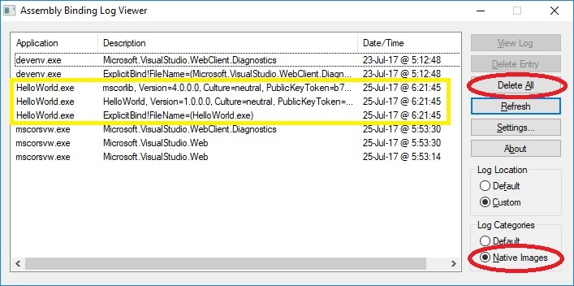
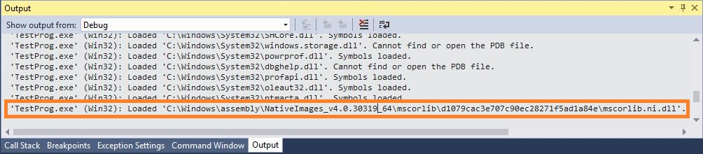

## NGEN and Native Images

### What is NGEN?

The Native Image Generator (`ngen.exe`) is a tool for the .NET framework that improves the performance of managed applications, by allowing to pre-compile .NET executables (MSIL code) into native machine code, saving the need to JIT-compile these functions at runtime.

### Using the correct NGEN

`ngen.exe` is located under `c:\Windows\Microsoft.NET\Framework[64]\VER`.  
It is imperative to use the correct `ngen.exe` version, which corresponds to your application settings - 32-bit/64-bit, and the same .NET version.  
For example, for .NET 4.0 (Windows 7.1 SDK) 64-bit executables, use `ngen.exe` located under `c:\Windows\Microsoft.NET\Framework64\v4.0.30319`.

For verifying that the native images generated by `ngen.exe` are indeed used at runtime, a utility called `FUSLOGVW.exe` provides a log view for the native image binder. For .NET 4.0 (Windows 7.1 SDK) 64-bit, it is located under `c:\Program Files\Microsoft SDKs\Windows\v7.1\Bin\x64`.

For convenience, you might want to add these folders to your `PATH` (globally, or in the working console window).

### Creating a native image

**Note: you must have administrator privileges for running `ngen.exe`.**

- From command prompt, in the folder where the executable to be imaged is placed, run:

  `ngen install MyProg.exe`

  This will create a native image for `MyProg.exe` and for every assembly/DLL it depends on.  
  For example, if not already present, a native image for `mscorlib` will be created for `mscorlib.dll`, which is the .NET runtime.  

  Native images are cached in the **NIC** (Native Image Cache), which is a subset of the **GAC** (Global Image Cache).  
  Example location for the NIC: `C:\Windows\assembly\NativeImages_v4.0.30319_64`.

- For verbose output, add the `/verbose` flag. This will give detailed information about the compiled module, including assembly settings, and location of the native image on the hard drive.

- For creating a native image suitable for a CLR profiler, add the `/profile` flag.

### Uninstalling a native image

- From command prompt, in the folder where the executable to be imaged is placed, run:

  `ngen uninstall MyProg.exe`
  
  This will remove the image from the NIC.  
  **Note:** dependent images of `MyProg.exe`, such as `mscorlib`, are **not** removed by `uninstall`.

- Alternatively, images could be removed by deleting them from the hard drive.  
  For example, deleting/renaming `c:\Windows\assembly\NativeImages_v4.0.30319_64\mscorlib` will effectively remove the images for `mscorlib`.

### Viewing installed images

- For checking if an image is installed, run from command prompt, in the folder the executable is located:

  `ngen display MyProg.exe`

  This will list all installed images for `MyProg.exe`.

- For verbose output, including assembly details, add `/verbose`.

- Images could also be qualified using the full assembly identifier string, which consists of assembly name, version, etc. For example:

  `ngen display "HelloWorld, Version=1.0.0.0, Culture=neutral, PublicKeyToken=null"`

- For the complete list of installed native images (which could be `grep`'d), run: `ngen display`.

### Verifying images loading

For verifying images are indeed loaded, the `FUSLOGVW.exe` utility could be used.  
`FUSLOGVW.exe` provides GUI for inspecting and managing the logs of the native image binder. 

**Note: You must have administrator privileges for configuring FUSLOGVW.exe.**

First, configure the utility:
- Run `FUSLOGVW.exe`.
- Toggle the `Native Images` radio button at the bottom right, under Log Categories.
- Under `Settings`, toggle `Log all binds to disk`.
- Optionally, check `Enable custom log path`, and specify a log path.

For checking whether the native image was loaded:
- Before running your program, click `Delete All` for removing old log entries.
- Run the program (e.g. `HelloWorld.exe`).
- Click `Refresh`.
- If the image was successfully loaded, several new log entries will appear.

For further troubleshooting, double click the log line in the GUI, and an .htm file will open (alternatively, it could be opened in a text viewer).  
If image binding was successful, the following would be printed out the log file: 

`LOG: Bind to native image succeeded.`

**Note**: Ideally, successful binding should occur for all dependants (such as `mscorlib`), but it might succeed for some and fails for others, in which case you may want to troubleshoot.

Additionally, when debugging a .NET program and stepping through the profiler API callbacks (i.e. debugging DNAgent), the `Debug` window, which displays the full path of each loaded DLL/native image, can indicate whether a native image was indeed loaded. If it was, it will be reported in the `Debug` window (after the `ModuleLoadStarted` callback is fired). For example:

### Useful links

- Official man page:  
  https://docs.microsoft.com/en-us/dotnet/framework/tools/ngen-exe-native-image-generator

- NGEN Primer:  
  https://blogs.msdn.microsoft.com/abhinaba/2013/12/10/ngen-primer

- Loading NGEN images and interaction with the GAC:  
  https://blogs.msdn.microsoft.com/abhinaba/2013/12/11/net-loading-native-ngen-images-and-its-interaction-with-the-gac

- NGEN and native images Troubleshooting:  
  https://kceiw.me/net-native-image-troubleshooting  
  https://blogs.msdn.microsoft.com/jianges/2012/08/09/how-to-troubleshoot-ngen-issues
